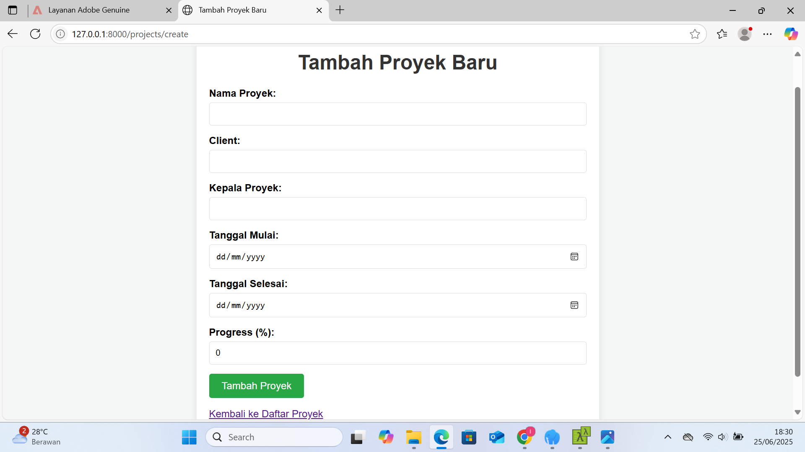
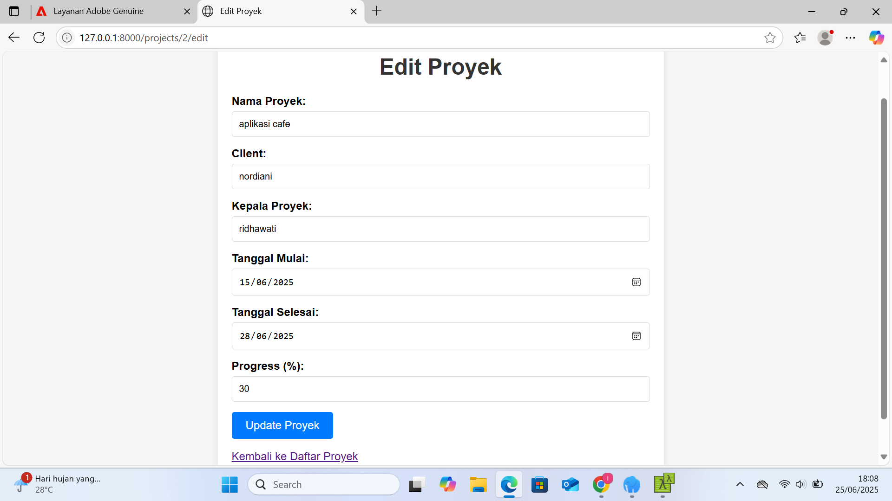

<p align="center">
  <a href="https://laravel.com" target="_blank">
    
  </a>
</p>

<p align="center">
  <a href="https://github.com/laravel/framework/actions">
    
  </a>
  <a href="https://packagist.org/packages/laravel/framework">
    
  </a>
  <a href="https://packagist.org/packages/laravel/framework">
    
  </a>
  <a href="https://packagist.org/packages/laravel/framework">
    
  </a>
</p>

---

# Sistem Project Monitoring 

Repositori ini berisi aplikasi berbasis Laravel yang digunakan untuk mengelola dan memantau proyek. Fitur utamanya meliputi input data proyek seperti judul, nama project leader, tanggal mulai dan berakhir, nama klien, progress, serta upload foto proyek.

## 👩‍💻 Dibuat oleh

**Ridhawati**  
D3 Teknik Informatika  
Politeknik Hasnur  

## 📌 Fitur
- CRUD (Create, Read, Update, Delete) data proyek
- Upload foto proyek
- Tampilan monitoring menggunakan tabel
- Desain responsif menggunakan Tailwind CSS
- Akses langsung tanpa login (open access)

## 🛠️ Teknologi yang Digunakan
- **Laravel 10**
- **MySQL**
- **Tailwind CSS**
- **Laravel File Storage (storage:link)**

## 📷 Screenshot Tampilan

> Pastikan folder `public/screenshots/` berisi file gambar berikut:

### 📋 Daftar Project


### ➕ Tambah Project


### ✏️ Edit Project


## 🚀 Cara Menjalankan Project (Lokal)

```bash
# Clone repository
git clone https://github.com/Ridhaawati/Sistem-Monitoring.git
cd sistem-monitoring-idha

# Install dependency Laravel
composer install

# Salin file .env dan generate key
cp .env.example .env
php artisan key:generate

# Konfigurasi database (di file .env)
# DB_DATABASE=your_db
# DB_USERNAME=your_username
# DB_PASSWORD=your_password

# Migrasi tabel ke database
php artisan migrate

# Buat symbolic link untuk file upload
php artisan storage:link

# Jalankan server
php artisan serve
